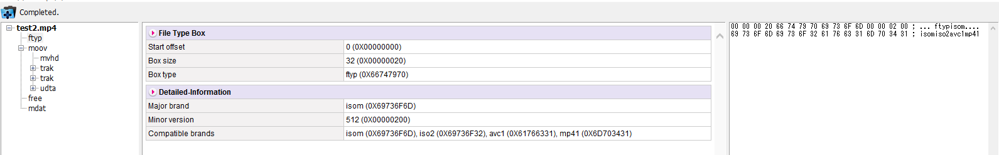
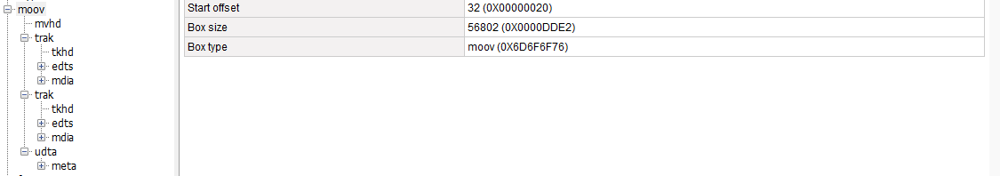
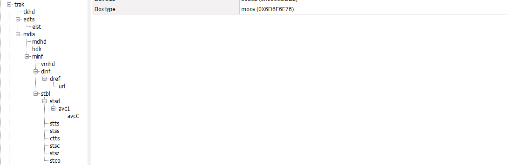
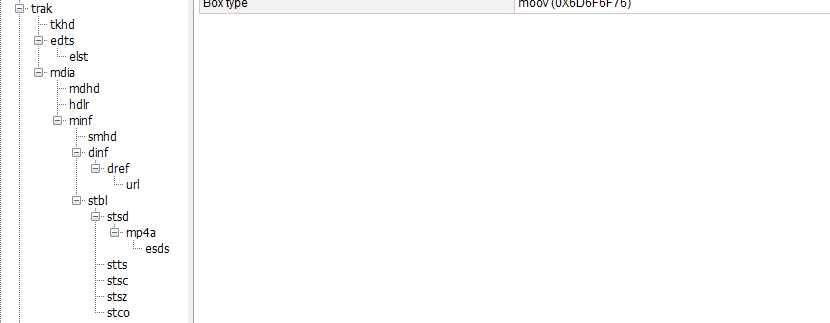

# Mp4ParserTools

### 1.使用mp4info工具
./mp4info test2.mp4
```
jeffmony@jeffmony-OptiPlex-7050:~/下载/Bento4-linux/bin$ ./mp4info test2.mp4
File:
  major brand:      isom
  minor version:    200
  compatible brand: isom
  compatible brand: iso2
  compatible brand: avc1
  compatible brand: mp41
  fast start:       yes

Movie:
  duration:   79756 ms
  time scale: 1000
  fragments:  no

Found 2 Tracks
Track 1:
  flags:        3 ENABLED IN-MOVIE
  id:           1
  type:         Video
  duration: 79580 ms
  language: und
  media:
    sample count: 1908
    timescale:    90000
    duration:     7162154 (media timescale units)
    duration:     79579 (ms)
    bitrate (computed): 543.192 Kbps
  display width:  960.000000
  display height: 540.000000
  frame rate (computed): 23.976
  Sample Description 0
    Coding:      avc1 (H.264)
    Width:       960
    Height:      540
    Depth:       24
    AVC Profile:          100 (High)
    AVC Profile Compat:   0
    AVC Level:            31
    AVC NALU Length Size: 4
    AVC SPS: [6764001facd940f0117ee100000303e90000bb800f183196]
    AVC PPS: [68ebe24b22c0]
    Codecs String: avc1.64001F
Track 2:
  flags:        3 ENABLED IN-MOVIE
  id:           2
  type:         Audio
  duration: 79756 ms
  language: und
  media:
    sample count: 1718
    timescale:    44100
    duration:     3517197 (media timescale units)
    duration:     79755 (ms)
    bitrate (computed): 32.020 Kbps
  Sample Description 0
    Coding:      mp4a (MPEG-4 Audio)
    Stream Type: Audio
    Object Type: MPEG-4 Audio
    Max Bitrate: 32019
    Avg Bitrate: 32019
    Buffer Size: 0
    Codecs String: mp4a.40.29
    MPEG-4 Audio Object Type: 29 (Parametric Stereo)
    MPEG-4 Audio Decoder Config:
      Sampling Frequency: 22050
      Channels: 1
      Extension:
        Object Type: Spectral Band Replication
        SBR Present: yes
        PS Present:  yes
        Sampling Frequency: 44100
    Sample Rate: 44100
    Sample Size: 16
    Channels:    2
```
这儿可以看到mp4文件的基本信息，还是比较详细的，media文件的轨道信息，以及轨道文件的基本信息；

### 2.使用mp4reader工具
mp4reader工具目前只有widnows版本的，需要在windows环境下安装；
打开一个mp4文件；









### 3.mac上类mp4reader工具介绍
mp4parser_macos.zip文件
